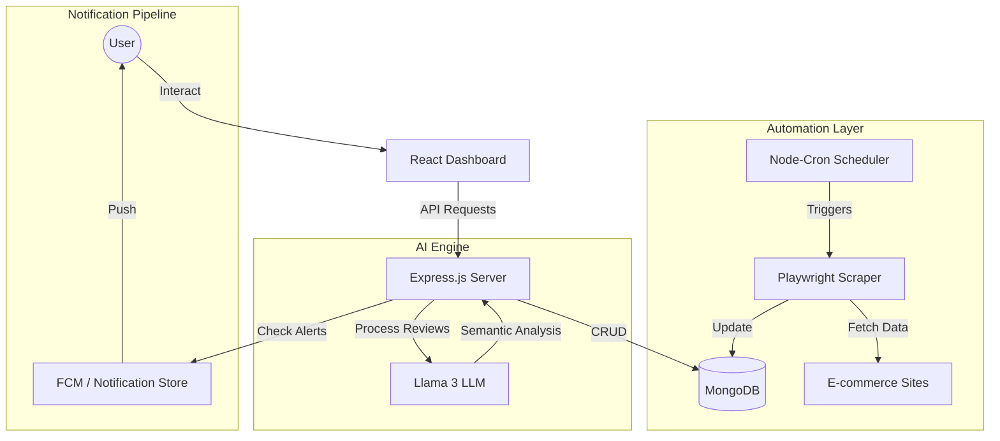

# <p align="center">🛒 ZEMO: AI-Powered E-Commerce Intelligence</p>

<p align="center">
  <strong>The next-generation autonomous price tracking and sentiment analysis engine.</strong>
</p>

<p align="center">
  
  
  
  
  
</p>

---

## 🌟 Overview

**Zemo** is a sophisticated, full-stack intelligence platform designed to empower consumers in the volatile e-commerce landscape. By combining **autonomous browser automation**, **asynchronous price monitoring**, and **Large Language Model (LLM)** driven sentiment analysis, Zemo transforms raw product data into actionable purchasing insights.

Traditional price trackers only show numbers; Zemo explains the *why* behind the product's value using advanced AI to distill thousands of customer reviews into structured semantic pros and cons.

---

## 🚀 Core Features

-   **🤖 Autonomous Intelligence**: Utilizes **Meta-Llama-3-8B** (via Hugging Face) to perform deep semantic analysis on product reviews, extracting categorized pros/cons with weighted importance.
-   **🕵️ Headless Browser Orchestration**: Powered by **Playwright**, the system performs stealthy, real-time scraping of price data and metadata from major e-commerce platforms, bypassing dynamic content hurdles.
-   **📈 Precision Price History**: Tracks every fluctuation with millisecond precision, visualized through interactive, high-fidelity **Plotly.js** charts.
-   **🔄 Historic Bootstrapping**: Capable of backfilling data by scraping historical price points from third-party indices, providing immediate value for newly added products.
-   **🔔 Smart Threshold Alerts**: A state-aware notification system that triggers real-time alerts via **Firebase** when products hit target price points or historic lows.
-   **⏱️ Industrial-Grade Scheduling**: Implements a robust cron-based polling engine that manages background tasks and ingestion pipelines with fault-tolerant retry logic.

---

## 🏗️ System Architecture

Zemo is built on a modular, service-oriented architecture designed for scalability and clear separation of concerns.



---

## 💻 Tech Stack

### **Frontend**
- **React 18**: Component-based UI architecture.
- **Tailwind CSS**: Utility-first styling for a premium, responsive design.
- **Plotly.js**: Advanced data visualization for price trends.
- **Lucide React**: Clean, modern iconography.

### **Backend**
- **Node.js & Express**: High-performance asynchronous API layer.
- **Mongoose**: Elegant MongoDB object modeling.
- **Playwright**: Industry-standard browser automation for robust scraping.
- **Node-Cron**: Reliable task scheduling for background synchronization.

### **AI & Cloud**
- **Meta-Llama-3-8B**: State-of-the-art LLM for sentiment processing.
- **Hugging Face Inference**: Serverless AI execution.
- **Firebase**: Authentication and real-time notification infrastructure.

---

## ⚙️ Workflow & Execution Pipeline

1.  **Product Ingestion**: User submits a URL. The system launches a headless browser instance to extract high-resolution metadata (Title, Images, Initial Price).
2.  **Monitoring Loop**: The `priceScheduler` service polls active products every 15 minutes, capturing price snapshots and calculating historic lows.
3.  **Alert Evaluation**: After each fetch, the system evaluates user-defined thresholds. If a drop is detected, a notification payload is dispatched.
4.  **Semantic Synthesis**: On-demand, the AI engine fetches the latest 100+ reviews, passes them through a tailored prompt to Llama 3, and returns a structured JSON of product insights.

---

## 📂 Project Structure

```text
├── backend/
│   ├── automation/      # Playwright scraping logic (Prices, Metadata, Reviews)
│   ├── controllers/     # API request handlers
│   ├── models/          # Mongoose schemas (Products, Alerts, PriceHistory)
│   ├── routes/          # Express route definitions
│   ├── scheduler/       # Cron job orchestration
│   ├── services/        # AI Analysis & Data processing logic
│   └── server.js        # Entry point & Middleware configuration
├── frontend/
│   ├── src/
│   │   ├── components/  # Reusable UI elements (Charts, Gauges, Cards)
│   │   ├── pages/       # High-level views (Dashboard, Insights, Profile)
│   │   ├── services/    # API abstraction layer
│   │   └── assets/      # Static resources
```

---

## 🔧 Installation & Setup

### **Prerequisites**
- Node.js (v18+)
- MongoDB Atlas or local instance
- Hugging Face API Token (for AI features)
- Firebase Project (for Auth/Notifications)

### **Backend Configuration**
Create a `.env` file in the `backend/` directory:
```env
PORT=5000
MONGO_URI=your_mongodb_connection_string
HF_API_KEY=your_huggingface_token
FIREBASE_CONFIG=your_firebase_json
```

### **Running the Project**
1.  **Install dependencies**:
    ```bash
    # Root directory
    npm install
    # Backend
    cd backend && npm install
    # Frontend
    cd ../frontend && npm install
    ```
2.  **Start Services**:
    ```bash
    # Run Backend (Port 5000)
    cd backend && npm start
    # Run Frontend (Port 5173)
    cd frontend && npm run dev
    ```

---

## 🔮 Future Roadmap

-   **Multi-Platform Support**: Expanding beyond Amazon/Flipkart to global retailers.
-   **Browser Extension**: Real-time tracking directly from the browser.
-   **Predictive Analytics**: Using LSTM models to predict future price drops based on historical patterns.
-   **Advanced Comparison Engine**: AI-driven feature-by-feature comparison between multiple tracked products.

---

## 📄 License
Distributed under the MIT License. See `LICENSE` for more information.

---

<p align="center">
  Made with ❤️ for the future of E-Commerce.
</p>
